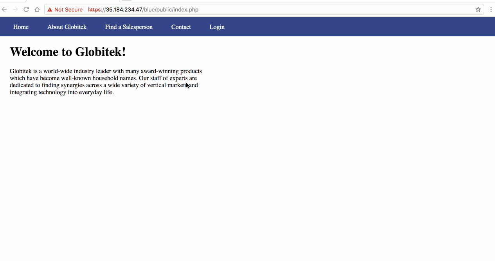
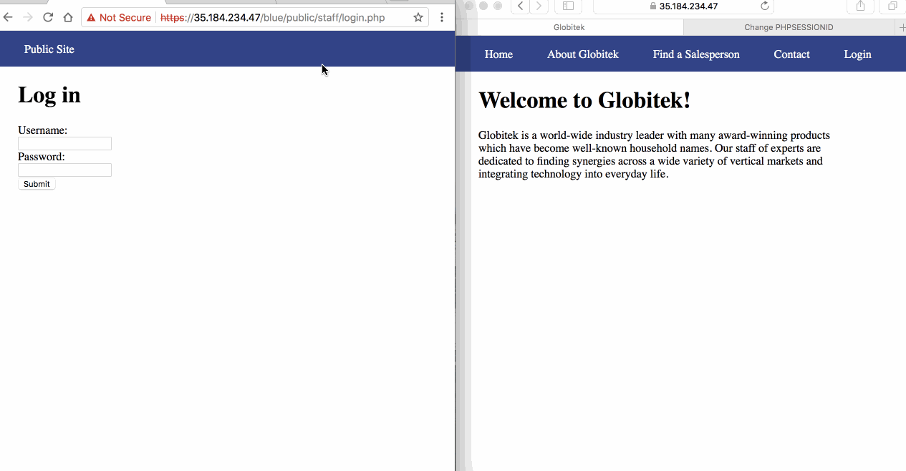
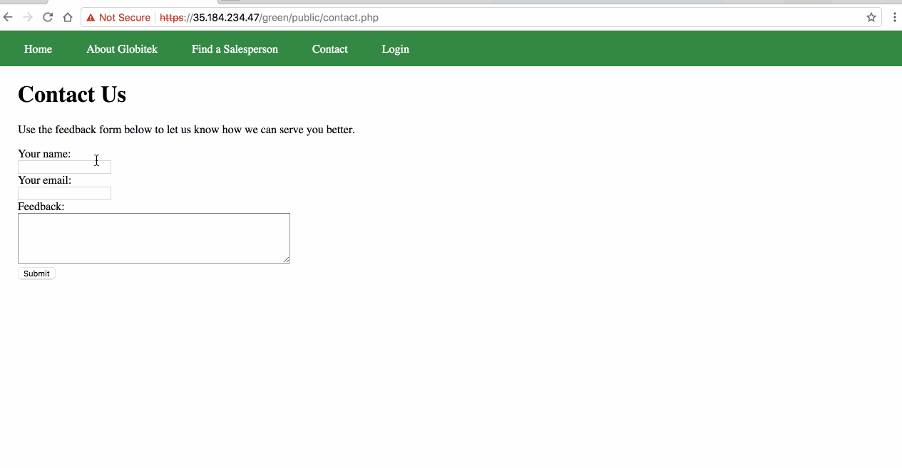
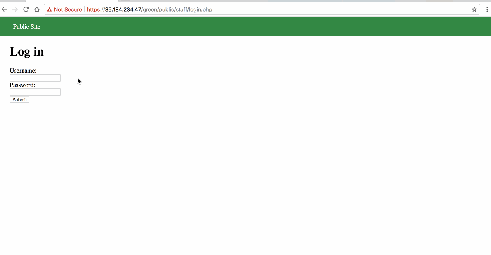
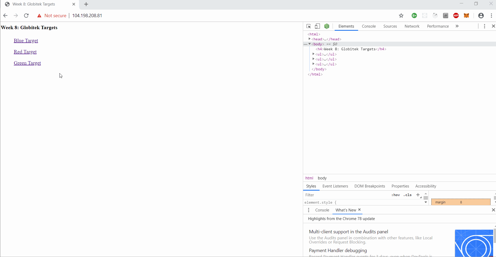
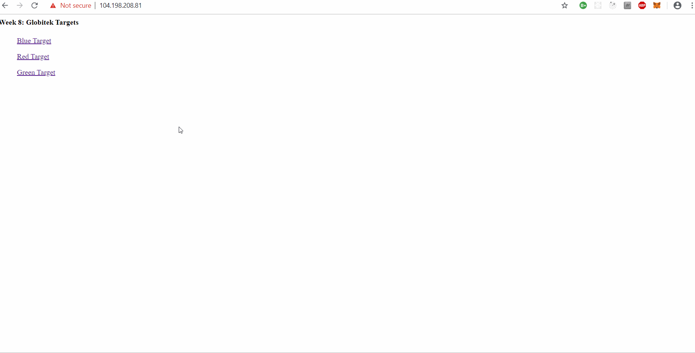

# Web_Security_CCNY_Week_9_Assignment
# Week 9 - Pentesting Live Targets

Time spent: **8** hours spent in total

> Objective: Identify vulnerabilities in three different versions of the Globitek website: blue, green, and red.

The six possible exploits are:
* Username Enumeration
* Insecure Direct Object Reference (IDOR)
* SQL Injection (SQLi)
* Cross-Site Scripting (XSS)
* Cross-Site Request Forgery (CSRF)
* Session Hijacking/Fixation

Each version of the site has been given two of the six vulnerabilities. (In other words, all six of the exploits should be assignable to one of the sites.)

## Blue

## Vulnerability #1: SQL Injection



Select the Salesperson section, there is "?id=X" at the end of the url, by entering a ' after X (X can be from 1 to 9), the blue section will show "Database query failed" while the green and red sections just redirect. This indicates that the blue section has SQLI vulnerability. I used ```?id=' OR 1=1'--``` to testify it.


## Vulnerability #2: Session Hijacking/Fixation



Login to the blue Globitek website, using this tool ```public/hacktools/change_session_id.php``` to get the session id. Then open blue Globitek website without login in another browser and set the session id to that session id, you will find that the website on another browser is also logined.

## Green

## Vulnerability #1: Username Enumeration



When I trying to login using a wrong username, the alert message is in plain text. But when I triyng to login using a correct username, the alert message appeared is bold. By inspecting the page, we could found that class is "failture" for correct username. The other class is "failed" for uncorrect username.


## Vulnerability #2: Cross-Site Scripting



In the Contact Us page, the script can be entered in Your Name and Feedback. For example, entering ```<script>alert('Shirong found the XSS!')</script>``` in both Your Name and Feedback, then go to feedback section in Staff Menu, the alert "Shirong found the XSS!" will appear twice. If you entern word instead of xss code in each section, then it will appear word. 

## Red

### Vulnerability #1: Cross-Site Request Forgery (CSRF)

One of the three sites does not have CSRF protections on the admin area. hen point the form action at each of the three sites to find out which color has the vulnerability. Do not neglect to be stealthy with your form—your unsuspecting, logged-in admin should neither see the form nor the results of the form submission.

### Vulnerability #2: Insecure Direct Object Reference (IDOR)

One of the three sites is missing code which would prevent some sensitive information from being made public. Determine which color has the vulnerability. Then, figure out what the other two sites did correctly to prevent the information leak.

The other two sites added a HTTP 302 response which is a common way of performing URL redirection. Now when a hacker tries to perform IDOR on the other sites, they will be redirected to ```/territories.php```
